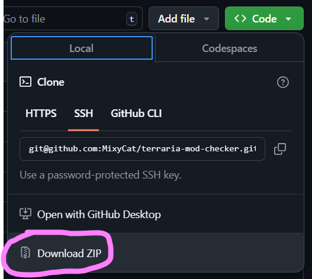

# Instructions
To download this program, click on "Code", download this program as a zip file and extract it anywhere you like. I would also recommend making a shortcut for the actual executable file itself in the dist folder rather than moving the executable itself.

Using the program itself is pretty simple. Assuming you have tModLoader installed and stuff, just enter the name of the modpack you want to compare to. It will open up a text file that will show you the difference in mods you have enabled and the modpack's mods.